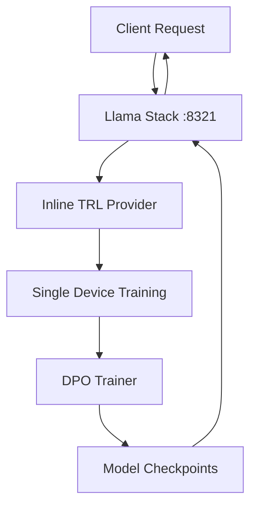
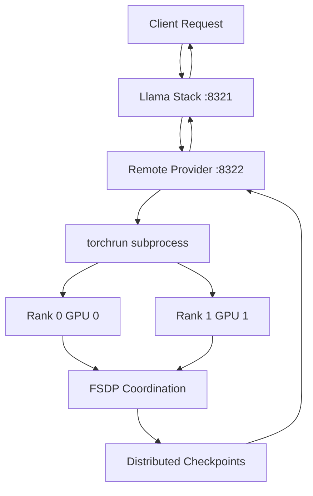

# TRL Provider for Llama Stack - Architecture Overview

This project provides **two complementary TRL providers** for Llama Stack, enabling both single-device and distributed DPO (Direct Preference Optimization) training.

## Dual Provider Architecture

### Inline Provider (`llama_stack_provider_trl`)
- **Purpose**: Single-device DPO training for development and small models
- **Integration**: Runs within Llama Stack process
- **Devices**: Single GPU, CPU, or MPS (Apple Silicon)
- **Memory**: Limited to single device memory
- **Use Cases**: Development, experimentation, small models (<7B parameters)

### Remote FSDP Provider (`llama_stack_provider_trl_remote`)  
- **Purpose**: Distributed DPO training for large models in production
- **Integration**: External service communicating via HTTP
- **Devices**: Multiple GPUs using FSDP (Fully Sharded Data Parallel)
- **Memory**: Sharded across multiple devices
- **Use Cases**: Production training, large models (7B+ parameters)

## Project Structure

```
llama-stack-provider-trl/
├── llama_stack_provider_trl/           # Inline Provider
│   ├── __init__.py                     # Provider entry point
│   ├── config.py                       # Single-device configuration
│   ├── post_training.py                # Main implementation
│   └── recipes/
│       └── dpo_training_single_device.py
│
├── llama_stack_provider_trl_remote/    # Remote FSDP Provider
│   ├── __init__.py                     # Remote provider entry point
│   ├── config.py                       # FSDP distributed configuration
│   ├── server.py                       # HTTP server for remote provider
│   ├── post_training.py                # Remote implementation
│   └── recipes/
│       ├── dpo_training_fsdp.py        # FSDP training logic
│       └── train_fsdp.py               # Standalone training script
│
├── providers.d/                        # Provider Specifications
│   ├── inline/post_training/trl.yaml   # Inline provider spec
│   └── remote/post_training/trl_fsdp.yaml # Remote provider spec
│
├── scripts/                            # Helper Scripts
│   ├── prepare-env.sh                  # Environment setup
│   ├── run-direct.sh                   # Run inline provider
│   └── run-remote-fsdp-server.sh       # Run remote provider
│
├── examples/                           # Usage Examples
│   └── examples.ipynb                  # Inline provider examples
│
├── build.yaml                          # Inline provider build
├── build_fsdp.yaml                     # FSDP provider build
├── run.yaml                            # Inline provider config
├── run_fsdp.yaml                       # FSDP provider config
└── README_FSDP.md                      # FSDP usage guide
```

## Architecture Details

### Inline Provider Flow

1. **Client Request** → Llama Stack (port 8321)
2. **Llama Stack** → Inline Provider (same process)
3. **Training** → Single device DPO training
4. **Response** → Client with job status/artifacts



### Remote FSDP Provider Flow

1. **Client Request** → Llama Stack (port 8321)
2. **Llama Stack** → Remote Provider HTTP API (port 8322)
3. **Remote Provider** → Launch torchrun subprocess
4. **torchrun** → Multiple distributed processes
5. **FSDP Training** → Coordinated across GPUs
6. **Checkpoints** → Saved in distributed format
7. **Response** → Back through HTTP chain



## Key Technical Components

### FSDP (Fully Sharded Data Parallel)

FSDP enables training of large models by:
- **Parameter Sharding**: Model weights distributed across GPUs
- **Gradient Sharding**: Gradients computed and stored distributedly
- **All-Gather**: Temporarily reconstruct parameters for computation
- **Reduce-Scatter**: Aggregate and distribute gradient updates

### Configuration System

Both providers use Pydantic models for type-safe configuration:

```python
# Inline Provider
class TrlPostTrainingConfig(BaseModel):
    device: str = "cuda"
    dpo_beta: float = 0.1
    max_seq_length: int = 2048
    # ... single-device settings

# Remote FSDP Provider  
class TrlRemoteFSDPConfig(BaseModel):
    fsdp_config: FSDPConfig
    torch_run_config: TorchRunConfig
    service_config: RemoteServiceConfig
    max_seq_length: int = 4096  # Larger for distributed
    # ... distributed settings
```

### Job Scheduling

Both providers use Llama Stack's `Scheduler` for async job management:
- **Non-blocking**: Training runs in separate processes
- **Status Tracking**: Real-time job status updates
- **Artifact Collection**: Checkpoints and metrics
- **Resource Management**: Memory monitoring and cleanup

### Distributed Coordination

The remote provider uses `torch.distributed.run` (torchrun) for:
- **Process Spawning**: Launch multiple training processes
- **Environment Setup**: Configure distributed environment variables
- **Fault Tolerance**: Handle process failures and restarts
- **Communication**: NCCL backend for GPU-to-GPU communication

## Configuration Examples

### Inline Provider (Single GPU)
```yaml
providers:
  post_training:
  - provider_id: trl
    provider_type: inline::trl
    config:
      device: "cuda"
      dpo_beta: 0.1
      max_seq_length: 2048
      use_reference_model: true
```

### Remote FSDP Provider (Multi-GPU)
```yaml
providers:
  post_training:
  - provider_id: trl_fsdp
    provider_type: remote::trl_fsdp
    config:
      fsdp_config:
        sharding_strategy: "FULL_SHARD"
        mixed_precision_policy: "bf16"
        cpu_offload: false
      torch_run_config:
        nproc_per_node: 2
        master_port: 29500
      max_seq_length: 4096
```

## Performance Characteristics

### Memory Usage

| Configuration | Model Size | Memory per GPU | Total Memory |
|---------------|------------|----------------|--------------|
| Inline (1 GPU) | 7B | ~14GB | 14GB |
| FSDP (2 GPU) | 7B | ~8GB | 16GB |
| FSDP (4 GPU) | 13B | ~8GB | 32GB |
| FSDP (8 GPU) | 30B | ~10GB | 80GB |

### Training Speed

- **Inline**: Optimal for single GPU utilization
- **FSDP**: Scales near-linearly with GPU count
- **Communication Overhead**: ~10-20% with good interconnects
- **Memory Bandwidth**: Critical bottleneck for large models

## Development Workflow

### Adding New Features

1. **Inline Provider**: For single-device optimizations
   - Edit `llama_stack_provider_trl/` files
   - Test with `run.yaml` configuration
   - Use for rapid prototyping

2. **Remote FSDP Provider**: For distributed features
   - Edit `llama_stack_provider_trl_remote/` files  
   - Test with `run_fsdp.yaml` configuration
   - Use for production-scale validation

### Testing Strategy

1. **Unit Tests**: Individual component testing
2. **Integration Tests**: End-to-end API testing
3. **Distributed Tests**: Multi-GPU coordination testing
4. **Performance Tests**: Memory and speed benchmarking

### Deployment Patterns

1. **Development**: Inline provider for experimentation
2. **Staging**: Remote provider with 2-4 GPUs
3. **Production**: Remote provider with 8+ GPUs
4. **Edge Cases**: CPU-only fallback with inline provider

## Future Extensions

### Planned Features

1. **Multi-Node Support**: Training across multiple machines
2. **Dynamic Scaling**: Add/remove GPUs during training
3. **Checkpointing**: Fault-tolerant distributed checkpointing
4. **Monitoring**: Advanced metrics and visualization
5. **Optimization**: Model parallelism and pipeline parallelism

### Integration Points

1. **Model Hub**: Direct integration with HuggingFace Hub
2. **Dataset Formats**: Support for more preference data formats
3. **Evaluation**: Built-in model evaluation capabilities
4. **Deployment**: Direct model serving integration

This dual-provider architecture provides maximum flexibility, allowing users to choose the right tool for their specific training requirements while maintaining a consistent API interface. 